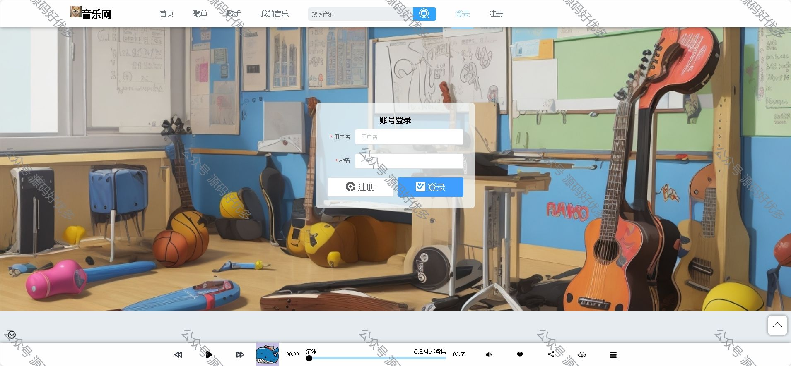

### 一、作品包含

源码+数据库+设计文档+全套环境和工具资源+部署教程

### 二、项目技术

前端技术：Html、Css、Js、Vue、Element-ui

数据库：MySQL

后端技术：Java、Spring Boot、MyBatis

### 三、运行环境

开发工具：IDEA/eclipse

数据库：MySQL8.0

数据库管理工具：Navicat10以上版本

环境配置软件： JDK1.8+Maven3.6.3

前端Nodejs：16

### 四、项目介绍

项目编号：springbootA013
该系统将提供丰富的音乐资源，包括各种流派和语种的音乐，满足用户的多样化需求。用户可以通过系统进行在线播放、收藏和下载音乐，方便地享受自己喜爱的音乐。同时，系统还提供用户登录功能，用户可以创建个人账号并管理个人信息，实现个性化的音乐推荐和定制化的播放列表。通过该系统，用户可以方便地享受音乐，提升音乐播放的便捷性和用户体验，满足用户对音乐的多样化需求。同时，管理员可以高效地管理音乐资源，提升管理效率和用户满意度。
用户端：
歌曲列表、歌单分类、收藏、评论、喜欢、音乐简介、登录、注册等
管理员端：
歌曲管理、歌手管理、歌单管理、收藏管理、用户管理、评论管理等功能

### 五、运行截图

